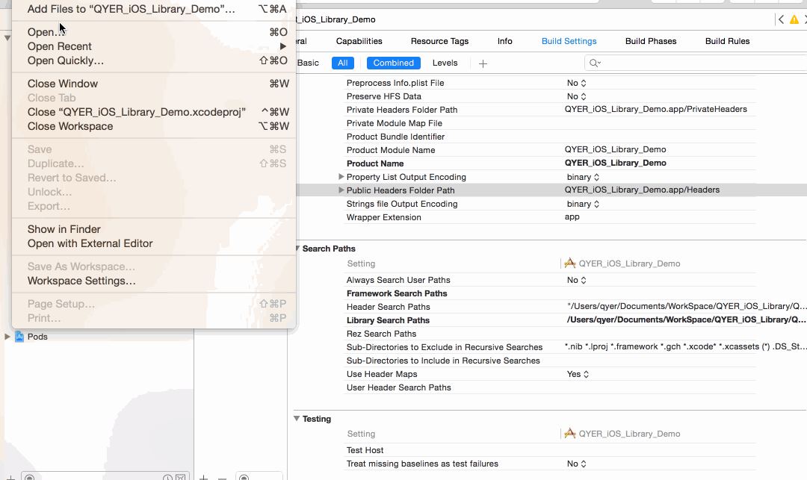

# 功能、性能
*  共享常用文件模板和代码片段
*  请求类生成校验和测试数据方法、生成getter方法
*  支持格式代码并输出 
*  自定义菜单热键
*  其它待扩展(共同维护，尽量少点体力劳动)

 所有操作均异步执行，执行完成后立即释放内存，除 一个监听XCode 的单例对象。

# 安装依赖、镜像模板
     
     依赖：clang-format 
     
     ***安装方法***
     git clone git@gitlab.dev:TangBin/QYXcodePlugIn.git
     cd QYXcodePlugIn
     ./setup_CodeHelper.sh

#  加载/更新 插件

     open QYXcodePlugIn.xcworkspace
     command + R
 
#  QYXcodePlugIn使用

  Edit->QYAction->AutoGetter   生成getter方法
         
      触发条件：在.m 文件中选择私有属性 
          
      自动生成Getter方法，只支持"引用类型" 如：
        
      @property (copy, nonatomic) NSString *testName;
        
      "值类型"将被忽略 如： NSInterge
      
  Edit->QYAction->RequestValidator   生成请求类的校验方法和测试数据 根据api返回范例
       
       触发条件：只有当前打开文件是QYRequest 的子类，并且在.m 文件中。否则没有反应
        
       生成对应请求类的 校验方法和测试数据方法。
       
  Edit->QYAction->Settings    自定义配置以上功能，及自定义菜单热键
 
       AutoGetter配置：使用JSON格式自定义某个类的getter内容
       如：
       {
         "UILabel": [
            "%@ = [[UILabel alloc] init];",
            "%@.textAlignment = NSTextAlignmentLeft;",
            "%@.font = [QYFont fontWithName:Default_Font size:0.0f];",
            "%@.textColor = [UIColor colorWithRed:0 / 255.0 green:0 / 255.0 blue:0 / 255.0 alpha:0.0];",
            "%@.numberOfLines = 0;",
            "%@.backgroundColor = [UIColor clearColor];"
           ]
       }
       
      %@用用替换私有变量如：_var,可以在线编辑JSON,然后替换setting 自定义getter的内容。
      
      
      RequestValidator配置：自定义校验方法名、测试方法名、在某个一请求基类的子类中触发、及是否生成测试方法。
      
# 演示
- 设置和文件模板
  
 
- 请求方法校验
  
  
- 生成getter
  

- 代码片段 自己diy 吧
  
  
- 文件模板和代码片段可以直接在这里添加
  

   