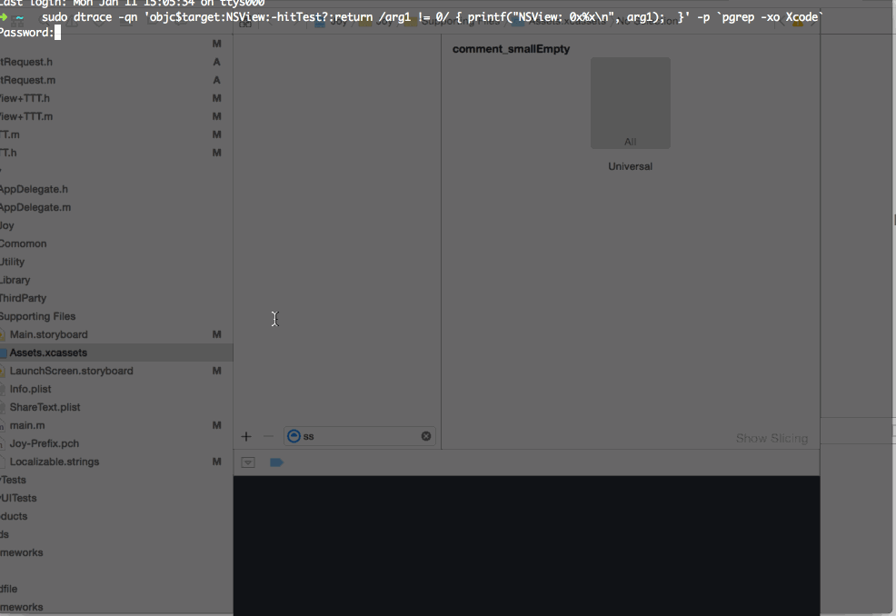
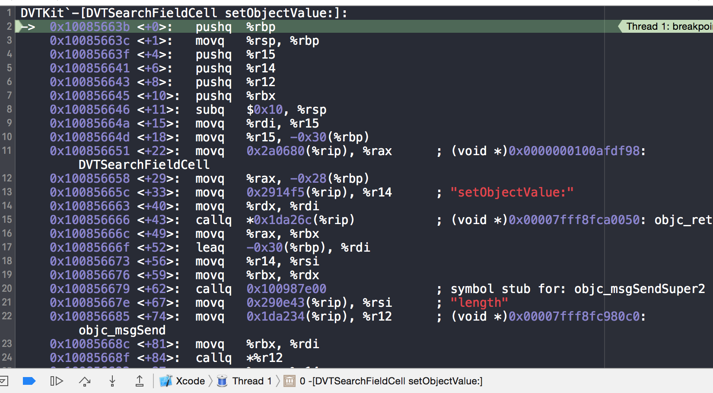
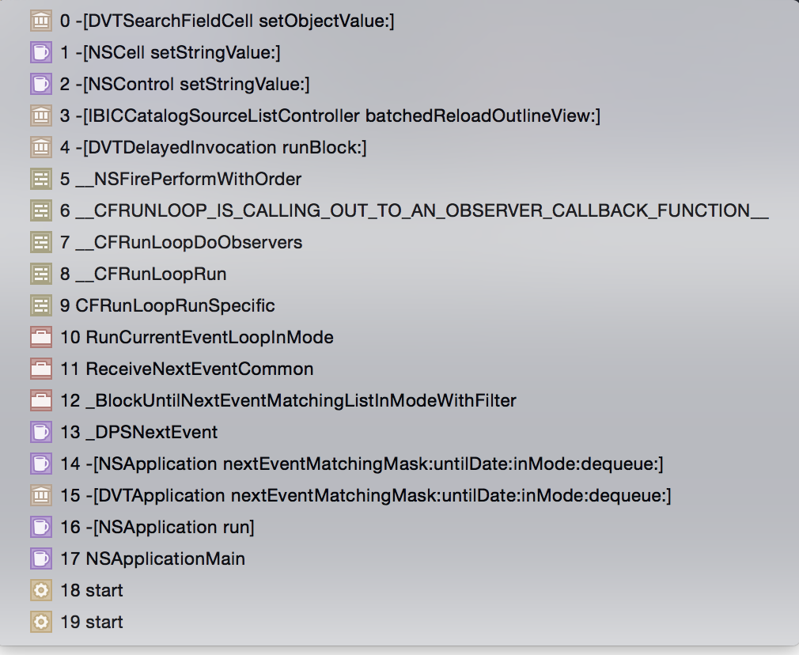

##  重置Asset Catalog资源列表搜索条件

Assets.xcassets 图片资源管理器, 搜索框会一直带上历史搜索条件。

## 必备知识&工具

[关于如何制作很cool的Xcode插件](http://www.raywenderlich.com/94020/creating-an-xcode-plugin-part-1) 里有很cool 知识和技巧，非常值得学习。

- LLDB 及 Xcode 中附带的一些很有用的的Python 脚本:  lldb.macosx.heap
- [Dtrace](https://www.objc.io/issues/19-debugging/dtrace/)
- [汇编 x86 assembly knowledge](https://www.mikeash.com/pyblog/friday-qa-2011-12-16-disassembling-the-assembly-part-1.html)
- add Symbolic Breakpoint

## 实现

#### 1,Dtrace 确定目标控件
 
	 sudo dtrace -qn 'objc$target:NSView:-hitTest?:return /arg1 != 0/ { printf("NSView: 0x%x\n", arg1);  }' -p `pgrep -xo Xcode`
	 
  Terminal或iTerm 执行上面dtrace 命令
  
  Dtrace 通过响应链-hitTest  返回鼠标点击的控件地址。粘贴最后一个地址，可以进入lldb 
  
        lldb
          //进入当前Xcode 实例
	  pro at -n Xcode
	  ...
	  //推出lldb
	  c
	  
  进入当前Xcode 实例，寻找地址对应控件类型。当然你要足够的了解当前点击的控件周围其它 view 或controler足够多的信息。所以我们需要使用 
  
   - superview\subviews
   - setBackgroundColor:  （注意这里是NSColor ）
   - setHidden:
   - ..其它方法
   
  
  
####  2,探寻更多信息
 
   xcode lldb 提供了一写很cool 的python 脚本，来了解内存里的更多信息
   
		 (lldb) command script import lldb.macosx.heap
  
   上面发现搜索控件是 DVTSearchField * 0x7f8e05d50ba0
   
        (lldb) malloc_info -t 0x7f8e05d50ba0
	     0x00007f8e05d50ba0: malloc(   272) -> 0x7f8e05d50ba0 DVTSearchField.NSSearchField.NSTextField.NSControl.NSView.NSResponder.NSObject.isa (DVTSearchField) *addr = {
	  NSSearchField = {
	    NSTextField = {
	      NSControl = {
	        NSView = {
	          NSResponder = {
	            NSObject = {
	              isa = DVTSearchField
	            }
	            .....
   查看内存中的实例0x7f8e05d50ba0 ,它是NSSearchField 的子类。所以我们可以查看cocoa api 中NSSearchField 都有什么方法，怎么使用。但是DVTSearchField 我怎么知道它又什么方法呢。
   
	   image lookup -rn "\-\[DVTSearchField.*" 
	   或
	   i  loo -rn "\-\[DVTSearchField.*" 
  image lookup -rn 正则表达式 可以让我们搜索所有当前实例使用的框架、自定义类中搜索指定的方法定义。
  
  现在我们知道了私有API DVTSearchField * 0x7f8e05d50ba0 的所以信息，实例包含的变量、实例方法定义、类方法定义。
  
  当然需要你耐心的去搜寻一些有用的信息。如果你不想一条一条的去寻找匹配出来的信息，已经有人把所以Xcode 用的私有框架API，全部放在了gitHub 上。当然只有.h 文件。
  
  可以这里下载[Xcode-RuntimeHeaders](https://github.com/luisobo/Xcode-RuntimeHeaders)
  
 
####  3,断点 
     
  NSSearchField 或者 DVTSearchField 里有个三个Cell
  
	  @property(readonly) DVTSearchFieldCell *cell;
	  @property(readonly) NSButtonCell *cancelButtonCell;
	  @property(readonly) NSButtonCell *searchButtonCell;
	  
 DVTSearchFieldCell 这个肯定引起了你的注意，不防查查相关api ,或 i  loo -rn .. 
 
	 - (id)initTextCell:(id)arg1;
	 - (void)setObjectValue:(id)arg1;
	 
这两个方法是不是更有可能是 给DVTSearchField 赋值搜索文本的
 
  让我们启动一个插件实例，从Xcode 里调试它的私有API 
  
  add Symbolic Breakpoint
   
   - -[DVTSearchFieldCell setObjectValue:]
   - -[DVTSearchFieldCell initTextCell:]
   
   让实例进入Assets.xcassets,进入断点
   
   
   
   对于 
   
	   aClass *aClassInstance = [[aClass alloc] init];
	   [aClassInstance aMethodWithMessage:@"Hello World"];
	   
   会被编译转换成objc_msgSend(target,SEL,arg1....)
   
	   objc_msgSend(aClassInstance, @selector(aMethodWithMessage:), @"Hello World")

  汇编代码中
  
  - $rdi 指向 target
  - $rsi 指向 SEL
  - $rdx 指向 arg1
  - $rcx 指向 arg2
  - ...
  - $rax 指向 消息返回值
  
  让我们一直继续断点，不断打印参数
  
	  po $rdx
	  
  在你的实例启动的过程中一直会进入断点，让我们一直跳过断点，直到我们实例显示出界面但还没有显示完成Assets.xcassets （这里我的实例一启动就默认选中Assets.xcassets,即上一次关闭Xcode 时的界面）。
  
  最终会找到搜索框里赋值的字符串。
  
	 (lldb) po $rdx
	  ss
 这时候我们有必要来了解一些这个你最后一次搜索的字符串 从哪里来的，并在断点中赋值给DVTSearchField
 
 查看Tread1 当前主线程的调用堆栈是个可行的办法
 
	 
	 
往下回溯发现前三个大同小异,只不过是从父类调到子类,第四个和第五个是离 **ss** 字符串来源最近的调用

	-[IBICCatalogSourceListController batchedReloadOutlineView:]
	-[DVTDelayedInvocation runBlock:]:

调试发现这两方法都会调用多次，
DVTDelayedInvocation 调用一个block 多次，进入batchedReloadOutlineView。直到IBICCatalogSourceListController 显示完成。

所以最有可能的是-[IBICCatalogSourceListController batchedReloadOutlineView:] 里面来的**ss** 搜索字符串。

google 或i loo -rn .. 看看IBICCatalogSourceListController 都有什么API和成员变量.

	 (lldb) po $rdi
     <IBICCatalogSourceListController: 0x117a4f4b0 representing: (null)>
     
	(lldb) command script import lldb.macosx.heap
	"crashlog" and "save_crashlog" command installed, use the "--help" option for detailed help
	"malloc_info", "ptr_refs", "cstr_refs", and "objc_refs" commands have been installed, use the "--help" options on these commands for detailed help.
	
	(lldb) malloc_info -t 0x117a4f4b0    
	
	  _nibName = 0x0000600004a70380 @"IBICCatalogSourceListController"
          _nibBundle = 0x0000608000099aa0 @"/Applications/Xcode.app/Contents/PlugIns/IDEInterfaceBuilderKit.ideplugin"
	  
可以发现这个是Xcode 私有插件里面的API。。意味你不可能指望 向IBICCatalogSourceListController 里面注入代码。

追了一路,到这线索好像全断了。。

#### 4,生命的真谛

**"ss"** 字符串只可能是从-[IBICCatalogSourceListController batchedReloadOutlineView:] 方法里来的。

搜寻IBICCatalogSourceListController 的API 发现除断点方法以外的

	-[IBICCatalogSourceListController viewDidInstall]
	-[IBICCatalogSourceListController viewWillUninstall];
	
很明显我们需要viewDidInstall 设置断点，有以下推论： 当 Assets.xcassets 的资源列表IBICCatalogSourceListController 打开的流程如下：

	-[DVTDelayedInvocation runBlock:]
        -[IBICCatalogSourceListController batchedReloadOutlineView:]
        -[IBICCatalogSourceListController viewDidInstall]

断点调试发现:实际上batchedReloadOutlineView 在viewDidInstall前后都会调用，除此之外我们还需要了解IBICCatalogSourceListController 更多信息。

继续断点，并查看每次进入batchedReloadOutlineView断点的$rdi 值。在viewDidInstall 之后再次进入batchedReloadOutlineView断点时,查看
  
	(lldb) malloc_info -t 0x117a4f4b0
	0x0000000117a4f4b0: malloc(   368) -> 0x117a4f4b0 IBICCatalogSourceListController.IDEViewController.DVTViewController.NSViewController.NSResponder.NSObject.isa (IBICCatalogSourceListController) *addr = {
	....
	          NSObject = {
	            isa = NSKVONotifying_IBICCatalogSourceListController
	          }
	          _nextResponder = 0x00006000003fae00
	        }
	    ..
	     _stateToken = 0x0000600000664140
	  }
	  ...
	  _previousFilterText = nil
	  _filterText = 0x0000000000737325 @"ss"
	  _filterComponents = nil
	  ..
	}
	(lldb)

见到了一丝光明有没有：

 - _filterText = 0x0000000000737325 @"ss"
 - _previousFilterText = nil 上一次的搜索条件
 - _filterComponents = nil   搜索完成的数组

我们拿到了"ss"字符串的地址 **0x0000000000737325**

	(lldb) ptr_refs 0x0000000000737325
	0x0000600002432620: malloc(    32) -> 0x600002432620
	0x0000000117a4f5a0: malloc(   368) -> 0x117a4f4b0 + 240 IBICCatalogSourceListController._filterText

"ss"除了被IBICCatalogSourceListController._filterText 0x117a4f4b0 引用还被0x600002432620 引用，

 - 看看它是什么 malloc_info -t xx
 - 它又被什么引用 ptr_refs xx
	
 
		(lldb) malloc_info -t 0x600002432620
		0x0000600002432620: malloc(    32) -> 0x600002432620
		(lldb) ptr_refs 0x600002432620
		0x0000600002c58020: malloc(    48) -> 0x600002c58000 + 32   
		(lldb) malloc_info -t 0x600002c58000
		0x0000600002c58000: malloc(    48) -> 0x600002c58000 __NSDictionaryM.NSMutableDictionary.NSDictionary.NSObject.isa (__NSDictionaryM) *addr = {
		  [0] = {
		    key = 0x00006000024325c0 @"previousFilter"
		    value = 0x0000000000737325 @"ss"
		  }
		  [1] = {
		    key = 0x0000600002c57fd0 @"expandedItemIDs"
		    value = 0x0000600002c57fa0 1 object
		  }
		}
刨根问底，重复上面步骤。
下一个步当然是查找这个字典**0x600002c58000** 从哪里来。

一路查找看看我们查找出来了什么

     {
	      ... 上面好多key ..
		  DefaultEditorStatesForURLs =     {
		    "Xcode.IDEKit.EditorDocument.AssetCatalog" =         {
			 ...
			 detailController = IBICCatalogOverviewController;
			 lastFocusedArea = sourceListArea;
			 selectedItemIdentifiers = "{(\n)}";
			 ...一些key
			 "source-list-area" =                 {
			    expandedItemIDs = "{(\n    \".\"\n)}";
			    //看到没、看到没、看到没、看到没、看到没、看到没、看到没、看到没、在这呢。为毛没法加粗啊。。。
			    previousFilter = ss;

			   };
			 sourceItems = "{(\n    \"./Comment/comment_smallEmpty.imageset\"\n)}";
		     };
		  .....下面很长很长
		 );
	    }

      (lldb) ptr_refs 0x600005079340
      0x0000600000598ac8: malloc(   208) -> 0x600000598a10 + 184    IDEEditorBasicMode.IDEEditorModeViewController._lastSetPersistentRepresentation
		
 这样一层一层的回溯发现最终到了一个私有属性
 
     IDEEditorModeViewController._lastSetPersistentRepresentation。。
		 
下面查找相关API google 或者 i loo -rn xxx
 
     -[IDEEditorModeViewController revertStateWithDictionary:]
     -[DVTStateToken _pullStateFromDictionary:]:
	 
调试这两个断点，并打印对应参数

     po $rdx
	   
有趣的是revertStateWithDictionary 只会调用一次，，而_pullStateFromDictionary 则会调用多次，每次进入都会调用。

有了以上信息 做MethodSwizzler应该很简单了
