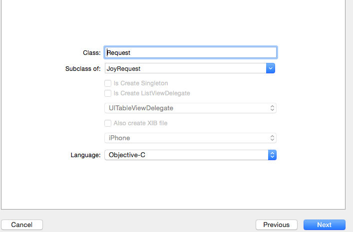

# 如何DIY Xcode文件模板
---
## 如何添加和删除？
如果你已经下载或安装了QYXcodePlugin,打开项目
 

 

QYFileTemplate 目录已经镜像了Xcode 用户自定义文件模板目录

	~/Library/Developer/Xcode/Templates/

可以直接在QYXcodePlugin 中直接修改添加删除文件模板

选中 QYCocoaToouchClass.xctemplate ->show  in finder 。然后再finder 里 

- 创建 customName+Objective-C 和 customName+Swift 文件夹。如：NSObjectSingletonObjective-C
- 从其它文件夹里拷贝：\_\_\_FILEBASENAME\_\_\_\.h/m 和 \_\_\_FILEBASENAME\_\_\_.swift 并修改之

## 如何DIY

在文件模板QYCocoaToouchClass.xctemplate通过TemplateInfo.plist管理了很多自定义文件模板。
打开看看：

Options配置了所有的自定义文件模板行为，展开看看

- Identifier: 唯一标示
- Required 是否必须
- Name 显示名
- Description 描述
- Type类型
- Default 是否默认显示该配置内容
- FallbackHeader 头文件
- Values QYCocoaToouchClass.xctemplate下所有文件夹命名的前缀即：customName。
- Suffixes 当你从文件模板创建文件时选中对应的cocoa 类,如你想创建一个JoyRequest的子类
上面className 自动会变成你配置的对应后缀名。
  
  
  
当进入上面界面时，会加载Options 里所以的配置，从上到下。

### item1 的意思： 

   Subclass of: 从cocoaTouchSubclass 个位标示的文件夹加载一些cocoa 类。包括values 里面你自定义的类JoyRequest

### item2 我自定义创建单例类的一些配置：

 - Identifier = Singleton
 - Name = Is Create Singleton
 - Type = checkbox （显示的控件，复选框）
 - RequiredOptions 一些必须的条件（只有这些条件满足才显示Name 的复选框）
   cocoaTouchSubclass 选中的cocoa 类必须为NSObject 
   
   Delegate 我自定义Is Create ListViewDelegate 复选框是没有选中的，情况下。

 - Suffixes 当选中NSObject 我上面类名的后缀名（可以为空或其它） 
 - Default 默认
 - NotPersisted YES

### item3 我自定义创建列表代理文件类的配置

  - Identifier = Singleton
  - ..
  - RequiredOptions 中第二个选项为Singleton 。即一个配置的标示名，这里我让Singleton 和  Singleton 两个配置互斥。

### item4 我自定义的列表代理文件类的配置

   - Identifier = ListViewDelegate
   - ...
   - Type = popup 选择框
   - RequiredOptions 中第二个选项是Delegate 配置标示，为true时。
   - Values  选择框的内容
     UITableViewDelegate、UICollectionViewDelegate
   - Suffixes 选中上面内容所对应的后缀名
   - Default 默认选中的内容popup中
   

这里我创建了两个自定义选项一个 Singleton  和  ListViewDelegate 。
Delegate 是他们的中间判断。

Singleton 和  Delegate 互斥，ListViewDelegate 依赖于Delegate 才显示。

### 文件查找规则

 - 从第一个item1开始，subClass of: 默认选中NSObject ，如果你选中其它的就是其它的类。。
 - subClass of:  复选框或者popup 所对应的配置（item[n]）的Identifier 从上到下一一判断是否满足。如果满足checkbox 取Identifier，如果满足popup 取选中的popup 内容。 
   
 - 在QYCocoaToouchClass.xctemplate 中寻找item1（calssName）+ checkbox(Identifier)+ popup(content) +..+最后一个popup(object-c/swift)  
 
 如：
  
 - NSObject + Singleton + Objective-C 创建文件夹NSObjectSingletonObjective-C里的文件
 
 -  NSObject + Delegate + UICollectionViewDelegate + Objective-C 列表代理文件
 
 
 ---
 > 如果你在QYCocoaToouchClass.xctemplate finder 里创建了新的文件模板，记得加到QYXcodePlngin的文件导航里。。可以一眼看到。 并且把所有
  ：\_\_\_FILEBASENAME\_\_\_\.h/m/swift 从xcode 拷贝资源中移除，不然会编译错误。
  
 ---
  > 如何在模板中挖坑 ： <#你种萝卜的坑#>
  
 ---
  

